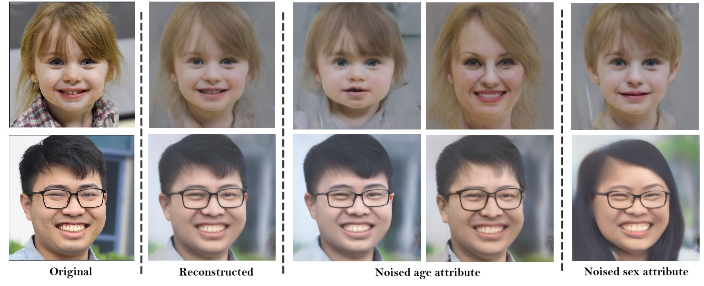

# Ensuring Privacy in Latent Space: Differentially Private Image Generation



**Figure:** *Ensuring differential privacy for specific facial attributes while preserving overall image quality results.*

## Introduction
In this repository, we propose a framework, which aims to privatize specific attributes in high-resolution facial images by manipulating the latent spaces of generative models. These models can synthesize photorealistic images while ensuring privacy through differential privacy.

[[Paper](https://arxiv.org/)]
[[Project Page](https://github.com/jamelof23/Latent_Attribute_Privacy)]
[[Colab](https://colab.research.google.com/github/jamelof23/Latent_Attribute_Privacy/blob/main/docs/Latent_Attribute_Privacy.ipynb)]

## Startup Instructions

1) Pick an image (Preferably 1024x1024 high-quality ) .
2) Run Latent_Optimizer.py
3) Tune training parameters (Set learning rate, optimizer, number of iterations, and VGG16 layer weights for optimization, Loss function parameters).
4) Generate a latent vector optimized.npy
5) Load generated latent vector in Latent_Attribute_Privacy.ipynb
6) Select specific attribute.
7) Generate an image with differentially private attribute manipulation.
   
```
# Before running Latent_Optimizer.py
   * Download the model stylegan_ffhq.pth and place it in /models/interfacegan_official/models/pretrain, you can download from https://huggingface.co/spaces/ybelkada/interfacegan_pp/blob/main/models/pretrain/stylegan_ffhq.pth
   * Pick up the file stylegan_generator.py from /enhanceed_files and replace the file in /models/interfacegan_official/models, the new file will enhance InterFaceGAN official model by allowing gradient-based updates and supporting multi-GPU training.


# Before running Latent_Attribute_Privacy.ipynb
   * Make sure to load optimized.npy which is the output of Latent_Optimizer.py or any 1×512 latent-vector in w space.
```

## Prior Work

Our work builds on InterFaceGAN for semantic face editing, which primarily relies on StyleGAN. However, we have enhanced the InterFaceGAN generator to support optimization with multiple GPUs. Additionally, we modified their Colab implementation to incorporate noised differential privacy. To achieve this, we used their boundaries in W space, which were trained using a StyleGAN model on the FF-HQ dataset, to ensure privacy in attribute manipulation.

StyleGAN:
  [[Paper](https://arxiv.org/pdf/1812.04948.pdf)]
  [[Code](https://github.com/NVlabs/stylegan)]
  
InterFaceGAN:
  [[Paper](https://arxiv.org/pdf/2005.09635)]
  [[Code](https://github.com/genforce/interfacegan)]


  ## BibTeX

